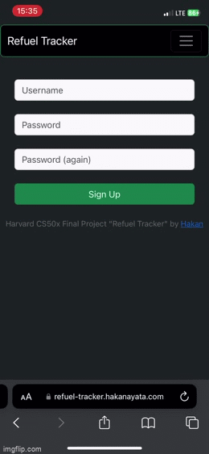
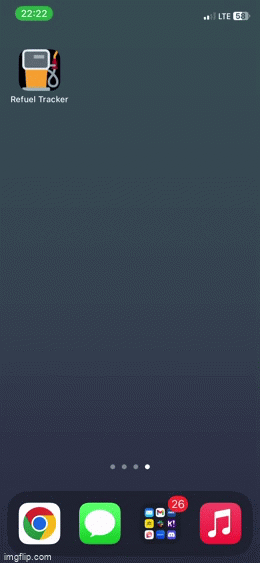
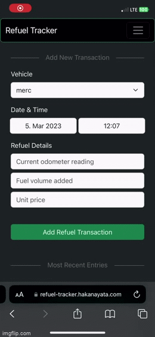
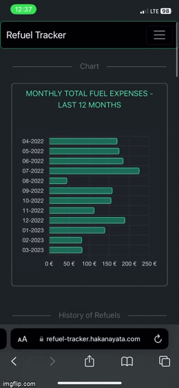
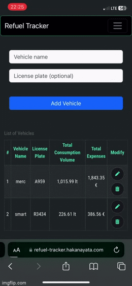
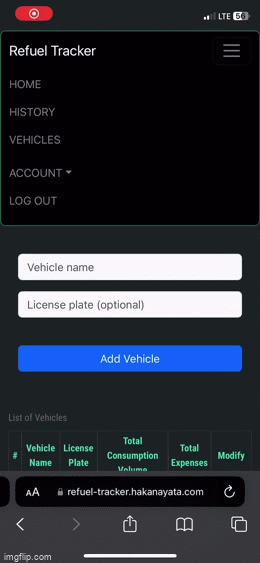

# REFUEL TRACKER :fuelpump:
### A web-based application helping users to keep track of their fuel consumption
#### Harvard CS50: Introduction to Computer Science - Final Project
##### Watch demo: [YouTube](https://youtu.be/LfjeUgx_3V4)
##### The App can be found at: [Refuel Tracker](https://refuel-tracker.hakanayata.com/login)

## Description: Web-based app built with python, js, and bootstrap

This web application was made as a [final project](https://cs50.harvard.edu/x/2022/project/) for [Harvard's Introduction to Computer Science](https://www.edx.org/course/introduction-computer-science-harvardx-cs50x) course. The goal was to stitch together all of the languages learned during the course and build a full-fledged web application.

Refuel Tracker App obliges users to keep track of the fuel consumption of their vehicles.

## Features

- a **signup page** that allows new users to register


  
  
<br>

- a **login page** that allows users to log in

  

<br>

- an **index page** that allows users 
  - to add new fuel purchase details including odometer reading, refuel volume added, and unit price of the fuel.
  - to view their last 3 fuel purchases and other data/statistics that might be useful such as total fuel expenditure in the entire history of purchases
  - to view a chart showing fuel expenses for the last 3 months
  

  

<br>

- a **history page** where users can see every purchase that has been made up to that moment, and let users do the following actions
  - edit an entry
  - delete an entry
  - save the table as pdf with a click of a button
  - view a chart showing fuel expenses for the last 12 months
  
  

<br>

- a **vehicles** page where users can
  - add vehicles that they want to keep track of
  - delete vehicles
  - edit vehicles' name and license plate number
  - view vehicles table where total consumption, and total expenses for each vehicle can be seen.

  

<br>

- an **account menu** that allow users 
  - to change their username
  - to change their password
  - to change their units (currency, distance, volume)

  

<br>
  
## Languages & Tools

- Python 3.11
- Flask 2.2
- Jinja 3.1
- HTML
- CSS
- Bootstrap 5.3.0
- Javascript
- PostgreSQL
- Postico 2
- SQLite3
- DB Browser for SQLite3
- Visual Studio Code
- Google Colab

<br>

## Potential Improvements To Do :crossed_fingers:
- Adding some visual features: light/dark mode, animations
- Integrating Google and Apple Sign-In to the application
- Allowing users to give access to other users to their vehicles so that vehicles' data can be viewed and edited for multiple users.
- Making use of Javascript's `navigator.geolocation.getCurrentPosition() ` function and adding a Location field to the table, allowing users to add location to their refuel transaction.


## Credits
- `@login_required` decorator, `login()`, `logout()` functions, and with some modifications, `errorMsg()` function utilized in this project were actually from CS50 Finance Project prepared by Harvard CS50 staff.

## Feedback
You might be able to test this application at: [refuel-tracker.hakanayata.com](https://refuel-tracker.hakanayata.com).
I would appreciate any kind of feedback. (See ***Contact*** below)


## Contact
I'm [Hakan](https://hakanayata.com). You could reach me at info@hakanayata.com


``` c
    int main(void){
      printf("Alright! This was CS50!");
    }
```
